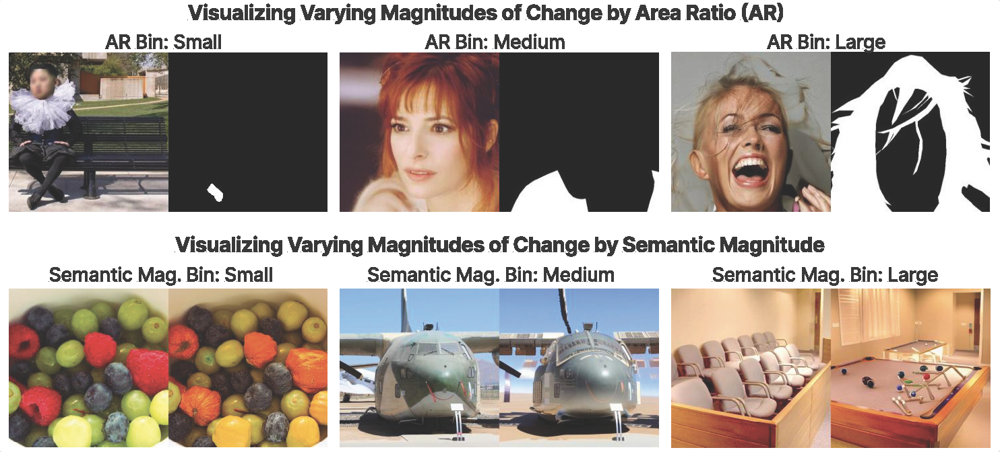
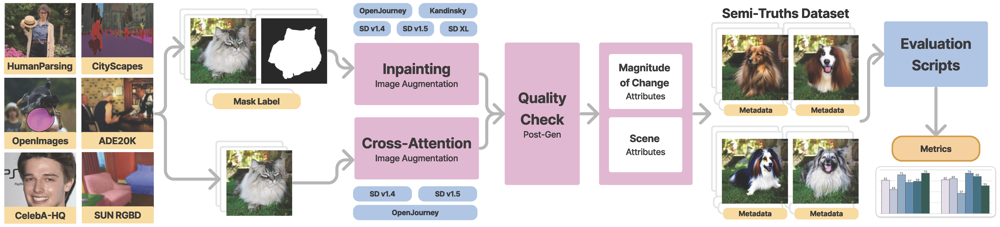

# Semi-Truths

<div align="center">
    

---

### Dataset for Evaluating AI-Generated Image Detectors on Various Magnitudes of Change (NeurIPS 2024)

[**Paper**](https://arxiv.org/abs/2411.07472)
| [**Full Dataset**](https://huggingface.co/datasets/semi-truths/Semi-Truths)
| [**Evaluation Set**](https://huggingface.co/datasets/semi-truths/Semi-Truths-Evalset)
<!-- | [**Website**](https://virajprabhu.github.io/lance-web/) -->

<!--  -->

</div>


## Get Started

```
conda create -n semi python=3.10
conda activate semi

cd LANCE/
pip3 install -r requirements.txt 

cd ../LLaVA/
pip3 install -e .

cd ..
pip install -r requirements.txt
```

NOTE: Some of LANCE dependancies conflict with LLaVA and Semi-Truths dependancies. You will notice "conflicting dependancy" warnings when configuring your environment, however, it will not impact your ability to run the code. Please proceed!


## Generating the SemiTruths Dataset

To demonstrate our pipeline for creating highly descriptive AI-Augmented images for evaluating detectors, we release a subset of input data used for this project as well as all relevant scripts.

The input data sample is sourced from existing semantic segmentation datasets (ADE20K, CityScapes, CelebAHQ, HumanParsing, OpenImages, SUNRGBD).

To simulate the data generation process on a small sample:

```
python generate_semi_truths.py
```

NOTE: Critical hyperparameters and data locations are declared in the `config.yaml` file. The user must update the data locations relative to your own directory structures. All other hyperparameter are set to reflect the configurations used to generate the Semi-Truths dataset.




## Stress-Testing

We release the stress-testing inference pipeline that was used to get predictions from SOTA AI-generated image detectors on the Semi-Truths dataset. Run:

```
cd stress_testing
python run_1.py
```
NOTE: An argparse is defined within this script that must be edited to reflect data locations.


## BibTex

If you find this work useful please like ❤️ our dataset repo and cite our paper. Thanks for your support!

```
@misc{pal2024semitruthslargescaledatasetaiaugmented,
      title={Semi-Truths: A Large-Scale Dataset of AI-Augmented Images for Evaluating Robustness of AI-Generated Image detectors}, 
      author={Anisha Pal and Julia Kruk and Mansi Phute and Manognya Bhattaram and Diyi Yang and Duen Horng Chau and Judy Hoffman},
      year={2024},
      eprint={2411.07472},
      archivePrefix={arXiv},
      primaryClass={cs.CV},
      url={https://arxiv.org/abs/2411.07472}, 
}
```

