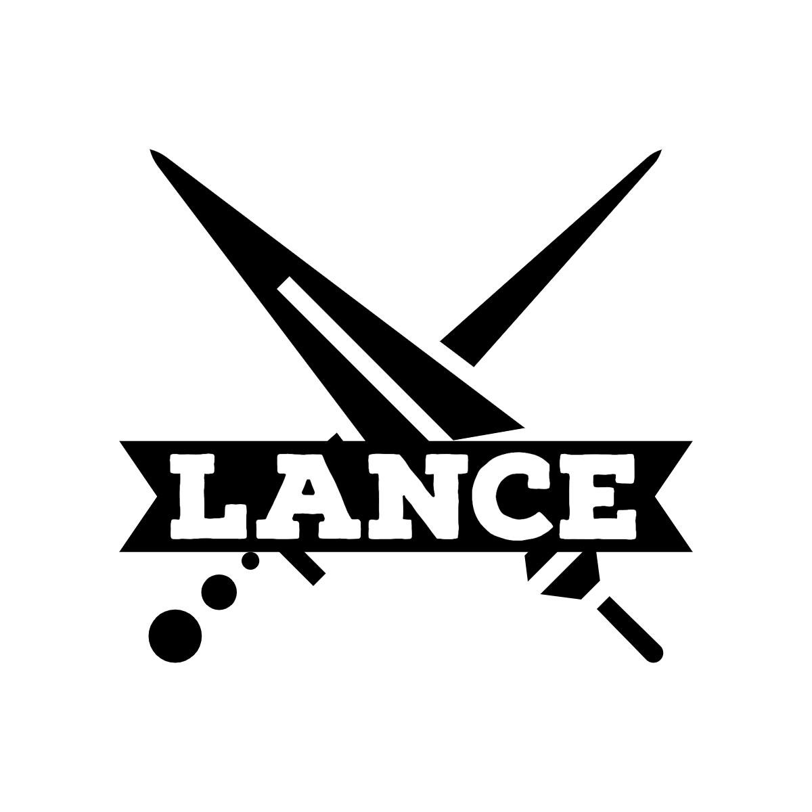
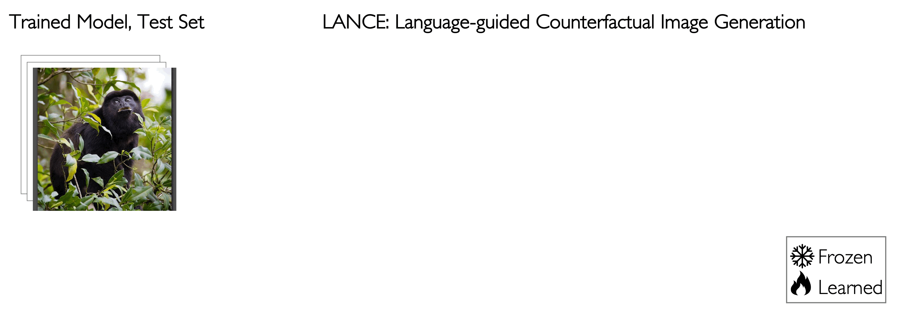

<div align="center">
    

---

### Stress-testing Visual Models by Generating Language-guided Counterfactual Images (NeurIPS 2023)

[**Website**](https://virajprabhu.github.io/lance-web/)
| [**News**](https://www.cc.gatech.edu/news/stress-test-method-detects-when-object-recognition-models-are-using-shortcuts)
| [**Walkthrough**](https://github.com/virajprabhu/LANCE/blob/master/walkthrough.ipynb)
| [**Contributing**](CONTRIBUTING.md)
| [**Paper**](https://huggingface.co/papers/2305.19164)

</div>

LANCE lets you stress-test your trained visual model before deployment by generating realistic and challenging test examples that may not be adequately captured by an IID test set. LANCE is useful to surface model bias that can inform downstream mitigation solutions. To do so, in addition to the generation pipeline, LANCE includes an analysis toolkit that surfaces class-level trends and model vulnerabilities. Further, LANCE is designed with with extensibility in mind, and can be easily extended to stress-test against additional variations not included in the original release.

## ⚡️ Quickstart

Installation and setup:
```
# Clone repo and submodules
git clone --recurse-submodules https://github.com/virajprabhu/lance

# Pip install
pip3 install -e .
```
And you're set!

## Usage: 

#### Running LANCE to stress test a trained model _interactively_

Running LANCE is as simple as:

```python
import lance

# Define test dataloader, model, and output directory
# dataloader = <..>
# out_dir = <..>
# model = <..>

# Generate counterfactuals
lance.generate(dataloader, out_dir, {})

# Evaluate generated counterfactuals against model
df = lance.inspect(model, out_dir, model.class_to_idx)

# Discover systematic model sensitivity and plot
df_cluster = lance.cluster_edits(df)
plot_sensitivity(df_cluster, <model_name>, <cls_name>, x="Edit Type", y="Sensitivity", sort_by=[])
```

And that's it! See [this notebook](https://github.com/virajprabhu/LANCE/blob/master/walkthrough.ipynb) for a detailed walkthrough for a real example.

#### Running LANCE at scale on a dataset

To run LANCE on one or more GPUs, we use the [accelerate](https://huggingface.co/docs/accelerate/index) library. Just run:
```
accelerate launch --num_processes <num_gpus> main.py --dset_name <dset_name> --img_dir <img_dir>
```

Where `<img_dir>` points to a ImageFolder style directory. Note that LANCE is designed to edit images that are 512x512 in resolution and will resize them accordingly. 

To reproduce results on HardImageNet, run:
```
accelerate launch --num_processes <num_gpus> main.py --dset_name HardImageNet \
                                                     --img_dir <imagenet_dir> \
                                                     --load_captions --load_caption_edits
```

## ✏️ Under the Hood

Given a trained model and test set, LANCE generates a textual description (from a captioning model) and perturbed caption (using a large language model or LLM), which is fed alongwith the original image to a text-to-image denoising diffusion probabilistic model (DDPM) to perform counterfactual editing. The process is repeated for multiple perturbations to generate a challenging test set. Finally, we ascertain model sensitivity to different factors of variation by reporting the change in its predictive confidence over the corresponding counterfactual test set. For more details, check out our paper: https://huggingface.co/papers/2305.19164 

<div align="center">
	
</div>


## ✉️ About

LANCE is being developed by graduate students in the [Hoffman Lab](https://faculty.cc.gatech.edu/~judy/) at Georgia Tech. 

If you would like to use LANCE or have questions, please reach out to `virajp [at] gatech [dot] edu`. 

If you use LANCE, please consider citing our paper:
```
@inproceedings{prabhu2023lance,
      title={LANCE: Stress-testing Visual Models by Generating Language-guided Counterfactual Images}, 
      author={Viraj Prabhu and Sriram Yenamandra and Prithvijit Chattopadhyay and Judy Hoffman},
      booktitle={Neural Information Processing Systems (NeurIPS)}
      year={2023}
}
```

## ✉️ Next steps

We hope to keep LANCE up to date with the latest generative models, as well as support a wide range of analysis. Below is a tentative list of features/optimizations we hope to add (note: contributions are welcome!)

> Generation

- [ ] LLAMA-2 support
- [ ] StableDiffusion-XL support
– [ ] CycleDiffusion editing
- [ ] Support localized editing via masking

> Analysis
- [ ] Custom stress-testing against user-defined intervention
- [ ] Object detection analysis

## ✉️ Acknowledgements

LANCE is built on top of several excellent research codebases, including [Prompt-to-prompt](https://github.com/google/prompt-to-prompt/), [LLAMA](https://github.com/facebookresearch/llama/blob/main/MODEL_CARD.md), [LiT-LLama](https://github.com/Lightning-AI/lit-llama) and [BLIP-2](https://github.com/salesforce/LAVIS/tree/main/projects/blip2), and additionally borrows a few techniques from [Instruct-Pix2Pix](https://github.com/timothybrooks/instruct-pix2pix). This repo also borrows from [meerkat](https://github.com/HazyResearch/meerkat) and [huggingface-transformers](https://github.com/huggingface/transformers).
